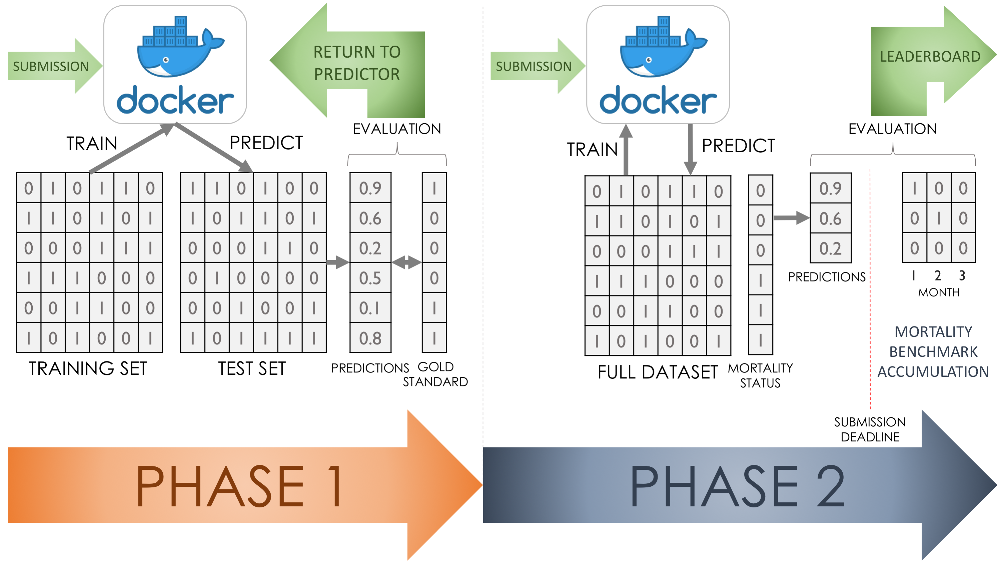

# Patient mortality prediction DREAM Challenge
This is the project management page for the Patient mortality prediction DREAM Challenge being carried out by Sage Bionetworks under the leadership of (Justin Guinney)[https://github.com/jguinney] and the University of Washington under the leadership of [Sean Mooney](https://github.com/sdmooney) and Graduate Student [Timothy Bergquist](https://github.com/trberg)

## Problem statement
Evaluation of predictive models in the clinical space is an every growing need for the Learning Health System. Typically, predictive models are developed and evaluated internally at healthcare organizations. External validation and comparison of different methods on the same set of benchmarks is rarely carried out. 

## Project description
### Mortality Prediction
We are tackling the stated problem by focusing on a specific prediction problem: **patient mortality**. Due to it's well studied nature and relatively well-established predictiveness, patient mortality serves as an easy benchmarking problem for assessing predictive models. These models are also widely adopted and implimented at healthcare institutions, a feature we hope will stimulate participation from a wide range of institutions.

### DREAM Challenges
DREAM challenges are an instrumental tool for harnessing the wisdom of the broader scientific community to develop computational solutions to biomedical problems. While previous DREAM challenges have worked with complex biological data as well as sensitive medical data, running DREAM Challenges with Electronic Health Records present unique complications, patient privacy being at the forefront of those concerns. Previous challenges have developed a technique known as the [Model to Data](https://www.nature.com/articles/nbt.4128) (MTD) approach to maintain the privacy of the data. We will be using this MTD approach, facilitated by docker, on an [OMOP](https://github.com/OHDSI/CommonDataModel) dataset provided by the University of Washington to make development of models standardized.

### Patient Mortality DREAM Challenge
We will carry out the DREAM challenge in two phases (Fig 1).

***The first phase*** will be a preliminary testing and validation phase. The UW OMOP data will be divided into a training and a testing set. Participants will submit their predictive models to our system where those models will train on the training set and predict on the test set. The prediction performance will be evaluated against the ground truth mortality status of those patients in the test set. The main objectives of the first phase are to allow the participants to become familiar with the submission system, to allow the evaluators to work out any issues in the pipeline, and to give participants a preliminary ranking on the performance of their model. 

***The second phase*** will be the prospective prediction phase. Participants will submit their final model which will train on the entire UW OMOP repository, making predictions on all living patients who have had at least one visit in the previous month. They will predict whether these patients will be deceased in the next 6 months by assigning a probability score to each of the patients. Predictors will be expected to setup up their own training dataset but the patient numbers for which a prediction is expected will be provided to the docker models.

Figure 1. Phase 1 will feature a training and test set by which preliminary model performance will be evaluated. During this phase, prediction performance will be returned to predictors in an iterative manner to enable the predictors to modify their models accordingly. Phase 2 will feature the finalized model submissions being evaluated against a prospectively accumulated gold standard benchmarking dataset. Predictors will be expected to develop their own training set in Phase 2. Predictions will be made on patients who have had at least one visit in the previous month.

## Contact person

Point person (github handle) | Site | Program Director
----------|--------------|---------------
Tim Bergquist (@trberg) | UW | Sean Mooney (@sdmooney)

## Project Scientific Leads 

Lead(s) (email) | Site
----------|--------------|
Justin Guinney (@jguinney) | Sage Bionetworks

## Team members 

Project Team Members

See [Team README](/team.md)

## Repositories
- https://github.com/data2health/DREAM-Challenge

## Deliverables
1. Code package for spinning up and running a Model to Data DREAM challenge on an OMOP repository.
2. Best practices and Standard Operating Procedure documentation for prospective model evaluation and benchmarking on EHR data.

## Milestones 

Due Date | Milestone | Status | 
----------|--------------|------------|---------------|
Feb 4 | Complete the aggregation and quality assessment of the UW cohort that will be used in the study. | [Done](#1)
Feb 27 | Conduct an internal evaluation by applying previously developed models to the UW cohort. | [Ongoing](https://github.com/data2health/DREAM-Challenge/milestone/2)
March 6 | Survey the CTSAs to find which sites have mortality and 30-day re-admission prediction models that would be willing to participate. | [Not Started](https://github.com/data2health/DREAM-Challenge/milestone/3)
March 20 | Build the Synapse pilot challenge site with instructions for participating in the challenge. | [Ongoing](https://github.com/data2health/DREAM-Challenge/milestone/4)
March 20 | Build the infrastructure for facilitating the DREAM challenge, using Docker, Synapse, and UW servers. | [Ongoing](https://github.com/data2health/DREAM-Challenge/milestone/5)
April 15 | **Phase 1**: Have a period of time where the parties identified in step 1 submit their models to predict on UW patients. This will not be a prospective evaluation. | [Not Started](https://github.com/data2health/DREAM-Challenge/milestone/6)
June 12 | **Phase 2**: Prospectively evaluate model performances, evaluating accuracy and recall between models. | [Not Started](https://github.com/data2health/DREAM-Challenge/milestone/7)
Jan 15 | Make scripts and documentation available for the CTSAs. | [Ongoing](https://github.com/data2health/DREAM-Challenge/milestone/8)

## Evaluation
Each project should propose a set of evaluation measures, recorded in a separate Evaluation Plan file, for example [here](https://github.com/data2health/project-repo-template/blob/master/evaluation.md). These will be reviewed by the Evaluation committee and approved by the Program Directors and NCATS. The Evaluation committee will meet with each Project team leads to assist. 

Each project should have Evaluation-realated issues, that can be tagged with the "evaluation" tag. see [Example Evaluation Issue](https://github.com/data2health/project-repo-template/issues/5)

## Education
Each project should propose a set of evaluation measures, recorded in a separate Evaluation Plan file. 
Please reference any of the following that apply: 
- Educational resources that will be generated (these can be milestones and/or files in the repo)
- Educational opportunities (please indicate for which type of learner and how to participate)
- Best practices guides

Please include education related issues where relevant, tagged with "education". 

## Get involved
We encourage the community to get involved. Please invite any participants to [onboard](http://bit.ly/cd2h-onboarding-form)

We require all CD2H projects to have non-CD2H CTSA participants, as CD2H is a CTSA coordinating center. Each project should include an Engagement plan file, example [here](https://github.com/data2health/project-repo-template/blob/master/engagement.md). 

Please tag any engagment related issues with "engagement".

## Working documents
Documentation may be natively in Github using the wiki or .md files in the appropriate folder, or in Google Drive.
[Documentating projects in Github](https://guides.github.com/features/wikis/)

[The project Google drive folder](https://drive.google.com/drive/u/0/folders/1vLp-H32KTNobiZF2cK82At90S6dVJNUf) is accessible to onboarded participants. 

## Slack room
[The project slack room](https://cd2h.slack.com/messages/C9D9SQWEQ) is accessible to onboarded participants.

