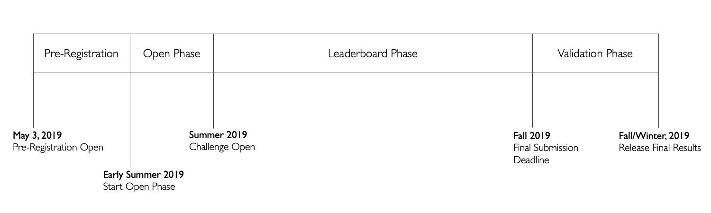

# EHR DREAM Challenge
The EHR DREAM Challenge is a series of community challenges to pilot and develop a predictive analytic ecosystem within the healthcare system.  

## Problem statement
Evaluation of predictive models in the clinical space is an ever growing need for the Learning Health System. Healthcare institutions are attempting to move away from a rules-based approach to clinical care, toward a more data-driven model of care. To achieve this, machine learning algorithms are being developed to aid physicians in clinical decision making. However, a key limitation in the adoption and widespread deployment of these algorithms into clinical practice is the lack of rigorous assessments and clear evaluation standards. A framework for the systematic benchmarking and evaluation of biomedical algorithms - assessed in a prospective manner that mimics a clinical environment - is needed to ensure patient safety and clinical efficacy.

## Alignment to program objectives
The primary objectives of the EHR DREAM Challenge are to :
* Lower barriers to piloting of innovative machine learning and data science methods in healthcare
* Establish clinically relevant prediction benchmarks and evaluation metrics
* Minimize the distance between the model developers and the clinic to reduce the time of model implementation

## Project description
### Mortality Prediction
We are tackling the stated problem by focusing on a specific prediction problem: **patient mortality**. Due to it's well studied nature and relatively well-established predictiveness, patient mortality serves as a well-defined benchmarking problem for assessing predictive models. These models are also widely adopted and implemented at healthcare institutions and CTSAs, a feature we hope will stimulate participation from a wide range of institutions.

### DREAM Challenges
 [DREAM challenges](http://dreamchallenges.org/) are an instrumental tool for harnessing the wisdom of the broader scientific community to develop computational solutions to biomedical problems. While previous DREAM challenges have worked with complex biological data as well as sensitive medical data, running DREAM Challenges with Electronic Health Records present unique complications, patient privacy being at the forefront of those concerns. Previous challenges have developed a technique known as the [Model to Data](https://www.nature.com/articles/nbt.4128) (MTD) approach to maintain the privacy of the data. We will be using this MTD approach, facilitated by docker, on an [OMOP](https://github.com/OHDSI/CommonDataModel) dataset provided by the University of Washington to make development of models standardized.

### Patient Mortality DREAM Challenge
We will ask participants of this DREAM Challenge to predict the future mortality status of currently living patients within our OMOP repository. After participants predict, we will evaluate the model performances against a gold standard benchmark dataset. We will carry out this DREAM challenge in three phases (Fig 1).

***The Open Phase*** will be a preliminary testing and validation phase. In this phase, the Synpuf synthetic OMOP data will be used to test submitted models. Participants will submit their predictive models to our system where those models will train and predict on the split Synpuf dataset. The main objectives of the first phase are to allow the participants to become familiar with the submission system, to allow the organizers to work out any issues in the pipeline, and to give participants a preliminary ranking on the performance of their model. 

***The Leaderboard Phase*** will be the prospective prediction phase carried out on UW OMOP data. Participants will submit their models which will have a portion of the UW OMOP repository available to them for training, making predictions on all living patients who have had at least one visit in the previous month. They will predict whether these patients will be deceased in the next 6 months by assigning a probability score to each of the patients. Participants will be expected to setup up their own training dataset but the patient numbers for which a prediction is expected will be provided to the docker models.

***The Validation Phase*** will be the final evaluation phase where challenge admins are able to finalize the scores of the models.

Figure 1. The Open Phase will feature a synethic training and test set to test the pipeline and participant models. The Leaderboard Phase will feature model submissions being evaluated against the UW OMOP repository. The gold standard benchmark set will be withheld from the docker models and used to evaluate model performance. Model performance metrics will be returned to the participants via Synapse.

## Project Scientific Leads 

Lead(s) (email) | Site
----------|--------------|
[Tim Bergquist](@trberg) | UW 
[Sean Mooney](@sdmooney) | UW
[Justin Guinney](@jguinney) | Sage Bionetworks
[Thomas Schaffter](@tschaffter) | Sage Bionetworks

## Team members 

Project Team Members

See [Team README](/team.md)

## Repositories and Websites
- https://github.com/data2health/DREAM-Challenge
- [Synapse Pre-registration Site](https://www.synapse.org/#!Synapse:syn18405991/wiki/589657)

## Deliverables
1. Code and Dockerized package for deploying an evaluation harness (e.g. Model to Data) for predictive algorithms applied against an OMOP CDM.
2. NCATS deployed and hosted evaluation harnesss using the OMOP CDM (see Deliverable #1) populated with SynPUFF data. 
3. Best practices and Standard Operating Procedure documentation for prospective model evaluation and benchmarking on EHR data.
4. Library of Dockerized algorithms for prediction of patient mortality - acquired through EHR DREAM Challenge - with performance metrics.

## Milestones 

  Due Date | Milestone    | Status     | 
|:----------|:--------------:|------------:|
Feb 4 | Complete the aggregation and quality assessment of the UW cohort that will be used in the study. | [Done](https://github.com/data2health/DREAM-Challenge/milestone/1)
Feb 27 | Conduct an internal evaluation by applying previously developed models to the UW cohort. | [Done](https://github.com/data2health/DREAM-Challenge/milestone/2)
March 6 | Survey the CTSAs to find which sites have mortality and 30-day re-admission prediction models that would be willing to participate. | [Ongoing](https://github.com/data2health/DREAM-Challenge/milestone/3)
March 20 | Build the Synapse pilot challenge site with instructions for participating in the challenge. | [Ongoing](https://github.com/data2health/DREAM-Challenge/milestone/4)
April | Build the infrastructure for facilitating the DREAM challenge, using Docker, Synapse, and UW servers. | [Ongoing](https://github.com/data2health/DREAM-Challenge/milestone/5)
June | **Phase 1**: Have a period of time where the parties identified in step 1 submit their models to predict on UW patients. This will not be a prospective evaluation. | [Not Started](https://github.com/data2health/DREAM-Challenge/milestone/6)
Summer | **Phase 2**: Prospectively evaluate model performances, evaluating accuracy and recall between models. | [Not Started](https://github.com/data2health/DREAM-Challenge/milestone/7)
Jan 2020 | Make scripts and documentation available for the CTSAs. | [Ongoing](https://github.com/data2health/DREAM-Challenge/milestone/8)

## Evaluation
See [here](https://github.com/data2health/DREAM-Challenge/evaluation.md)

## Education
See [here](https://github.com/data2health/DREAM-Challenge/education.md)

## Get involved
See [here](https://github.com/data2health/DREAM-Challenge/engagement.md)

## Working documents
[Phase II Proposal](https://docs.google.com/document/d/1b3hv9Owku002MrCAXH1jVjBkXVWAFamvSYb-bBILvQQ/edit?usp=sharing)

[The project Google drive folder](https://drive.google.com/drive/folders/1XJJDcVJBp-wZ6IBNZBcs-0HlSzvT2Z0g?usp=sharing) is accessible to onboarded participants. 

## Slack room
[The project slack room](https://cd2h.slack.com/messages/C9D9SQWEQ) is accessible to onboarded participants.

